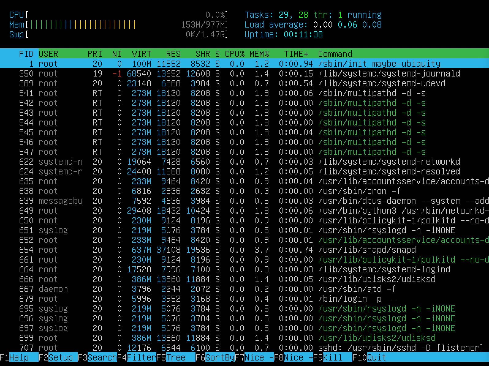
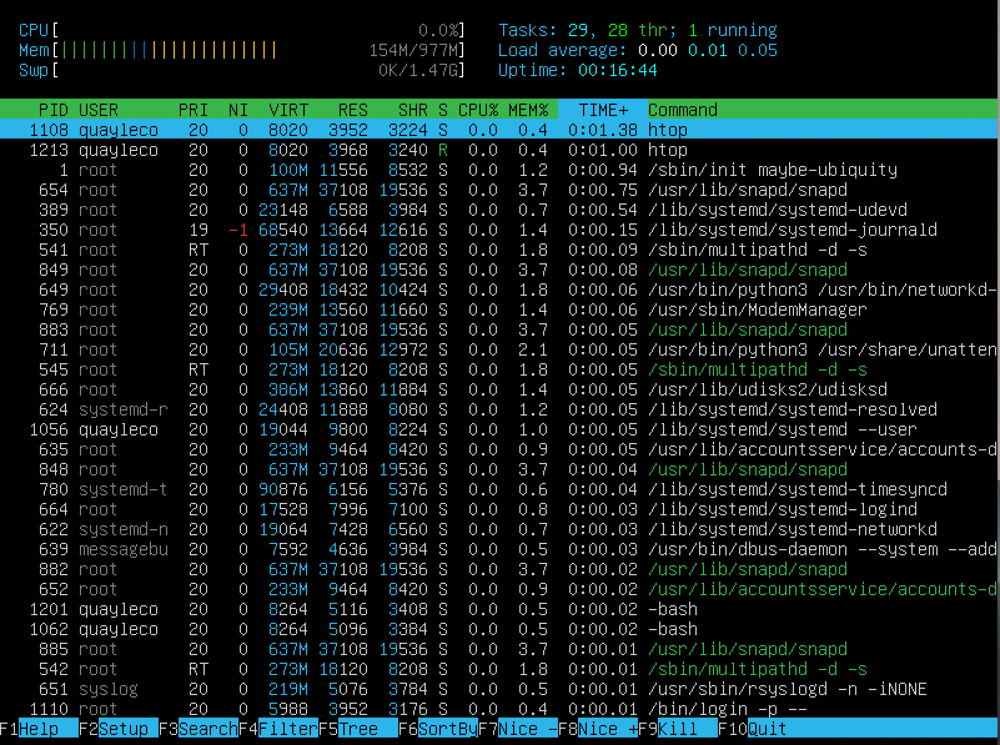

## Part 1. Установка ОС

- Скачиваем и устанавливаем **Ubuntu 20.04 Server LTS** без графического интерфейса.
- Для просмотра версии **Ubuntu** выполняем команду `cat /etc/issue`.\
  

## Part 2. Создание пользователя
- Создаем нового пользователя командой `sudo adduser <user name>`\
  
- Добавление пользователя в группу adm:\
  
- Проверка нового пользователя выполняется командой `cat /etc/passwd`\
  

## Part 3. Настройка сети ОС
- Открываем в текстовом редакторе файлы с названием машины и изменяем его:\
 `sudo vim /etc/hostname`\
  `sudo vim /etc/hosts`\
  Изменяем имя машины на user-1, сохраняем файлы и перезапускаем машину.\
  
- Перед сменой часового пояса вам нужно узнать длинное имя часового пояса, которое вы хотите использовать.
  Часовые пояса используют формат «Регион/Город».
  Чтобы вывести список всех доступных часовых поясов, вы можете либо перечислить файлы в каталоге /usr/share/zoneinfo,
  либо вызвать команду timedatectl с опцией list-timezones:
  `timedatectl list-timezones`.
- Для смены часового пояса приминяестя команда: `sudo timedatectl set-timezone your_time_zone`.
  В данном случае использовался часовой пояс `Europe/Moscow`.
  Что бы проверить изменения, вызывается команда `timedatectl`.
  
- Для вызова списка названий сетевых интерфейсов используется команда `ifconfig`.
  Данная команда предварительно не установлена в Ubuntu 20.04 Server LTS, установите пакет net-tools при помощи команды
  `sudo apt install net-tools`.
  
- lo (loopback device) – виртуальный интерфейс, присутствующий по умолчанию в любом Linux.
  Он используется для отладки сетевых программ и запуска серверных приложений на локальной машине.
  С этим интерфейсом всегда связан адрес 127.0.0.1. У него есть dns-имя – localhost.
- Для полученя ip адрес устройства, на котором вы работаете, от DHCP сервера использую команду `sudo dhcpcd -h enp0s3`
  предворительно воспользовавшись командой `sudo apt install dhcpcd5`.\
  
- DHCP (англ. Dynamic Host Configuration Protocol — протокол динамической настройки узла) —
  прикладной протокол, позволяющий сетевым устройствам автоматически получать IP-адрес и другие параметры,
  необходимые для работы в сети TCP/IP. Данный протокол работает по модели «клиент-сервер».
  Для автоматической конфигурации компьютер-клиент на этапе конфигурации сетевого устройства обращается
  к так называемому серверу DHCP и получает от него нужные параметры.

- Что бы отобразить внутрений ip-адрес шлюза можно использовать номанду `ip r`\

- Что бы отобразить внешний ip-адрес шлюза использутся команда `wget eth0.me -gO -`\

- Что бы задать (заданные вручную, а не полученные от DHCP сервера) настройки ip, gw, dns (использовать публичный DNS серверы, например 1.1.1.1 или 8.8.8.8) открываем файл по команде `sudo vim /etc/netplan/00-installer-config.yaml` и изменяем настройки:\

далее отключаем dhcp командой `systemctl stop dhcpcd` и применяем изменения командой `sudo systemctl restart`.

- Пропингуем удаленные хосты:\
  

## Part 4. Обновление ОС
- Обновить системные пакеты до последней можно применив команды:\
`sudo apt-get update`\
`sudo apt-get upgrade`.
- При повторном вводе ввыводится сообщение:\
  

## Part 5. Использование команды sudo
- Команда sudo ( substitute user and do, подменить пользователя и выполнить ) позволяет строго определенным
  пользователям выполнять указанные программы с административными привилегиями без ввода пароля суперпользователя root.
- Что бы дать ползователю разрешение на выполнение команды `sudo` вводится команда `sudo usermod -aG sudo <user name>`\
  Для смены пользователя выполняется команда `su - <name>`\
  
- Изменяем hostname как это делали в [Part 3](#part-3-настройка-сети-oc)\
  Результат изменения hostname:\
  

## Part 6. Установка и настройка службы времени
- Проверяем время командой `timedatectl`:\
  
- Проверяем работу автоматической синхронизации времени командой `timedatectl show`:
  

## Part 7. Установка и использование текстовых редакторов
- Для установки текстового редактора используется команда `sudo apt install <name of the text editor>`
- Используя каждый из трех выбранных редакторов, создайте файл test_X.txt, где X -- название редактора,
  в котором создан файл. Напишите в нём свой никнейм, закройте файл с сохранением изменений.
    - VIM:\
      \
      Для выхода с сохранением нажимаем `Esc` и вводим `:wq`, после чего нажимаем `Enter`.
    - NANO:\
      \
      Для выхода с сохранением нажимаем `ctrl + X`, затем подверждаем `Y` и `Enter`.
    - JOE:\
      \
      Для выхода с сохранением нажимаем `ctrl + K`, `Q` и `Y`
- Используя каждый из трех выбранных редакторов, откройте файл на редактирование, отредактируйте файл,
  заменив никнейм на строку "21 School 21", закройте файл без сохранения изменений.
    - VIM:\
      \
      Для выхода без сохранения нажимаем `Esc` и вводим `:q!`, после чего нажимаем `Enter`.
    - NANO:\
      \
      Для выхода без сохранения сохранением нажимаем `ctrl + X`, затем подверждаем `N``.
    - JOE:\
      \
      Для выхода без сохранения сохранением нажимаем `ctrl + K`, `Q` и `N`
- Используя каждый из трех выбранных редакторов, отредактируйте файл ещё раз (по аналогии с предыдущим пунктом),
  а затем освойте функции поиска по содержимому файла (слово) и замены слова на любое другое.
    - VIM:\
      поиск элемента пройсходит путем перехода из обычного режима в режим пойска нажатием `/`:
      
      для замены элемента используют команду `:s/.../.../`\
      
    - NANO:
      для поиска используют сочетание клавишь `Ctrl + W`
      
      
      для замены элемента используют сочетание клавишь `Ctrl + W` и `Ctrl + R`, после чего вводится то, что заменяется, после нажатие на `Enter` водится вводится новая строка, подвержаетя `Enter` и соглашается клавишей `Y`
      
      

## Part 8. Установка и базовая настройка сервиса SSHD

- Для установки службы SSHd приминяется следующая команда `sudo apt-get install ssh`
- Для добавления автостарта службы при загрузке системы используется команда `sudo systemctl enable ssh`\
  
- Для смены порта необходимо заменить порт на нужный в 
  файле sshd_config сохранить изменения и перезапрустить домен SSH.\
  `sudo vim /etc/ssh/sshd_config`\
  
  `sudo systemctl restart sshd`
- Используя команду ps, показать наличие процесса sshd. Для этого к команде нужно подобрать ключи.\
  `ps -C sshd`\
  
  Команда ps выводит список текущих процессов на сервере. Опция C фильтрует процессы по указанной строке.
- Перезагрузка системы происходит командой  `sudo reboot`
- Вывод команды `netstat -tan`\
  
  - Значение ключей -tan:\
    -t - Отображение текущего подключения в состоянии переноса нагрузки с процессора на сетевой адаптер при передаче данных ( "offload" ).\
    -a - Отображение всех подключений и ожидающих портов.\
    -n - Отображение адресов и номеров портов в числовом формате.
  - Значение каждого столбца вывода:
    - Proto - название протокола
    - Recv-Q - cчётчик байт не скопированных программой пользователя из - этого сокета
    - Send-Q - счётчик байтов, не подтверждённых удалённым узлом
    - Local Address - адрес и номер порта локального конца сокета
    - Foreign Address - адрес и номер порта удалённого конца сокета
    - Status - состояние соединение\
    Виды соединений:
    - ESTABLISHED - соединение установлено
    - SYN_SENT - сокет пытается установить соединение
    - SYN_RECV - начальная синхронизация соединения
    - FIN_WAIT1 - сокет закрыт, ожидание отключения соединения
    - FIN_WAIT2 - ожидание отключения удаленной стороны
    - TIME_WAIT - ожидание после закрытия повторной передачи отключения удаленной стороны
    - CLOSED - соединение закрыто, сокет не используется
    - CLOSE_WAIT - удаленный узел отключился, сокет скоро будет закрыт
    - LAST_ACK - сначала отключилась удаленная сторона, а затем сокет будет закрыт
    - LISTEN - сокет ожидает входящих соединений
    - CLOSING - закрытие сокета, точнее сокет закрыт, а затем отключился удаленный узел
    - UNKNOWN - состояние сокета неизвестно.
  - Значение 0.0.0.0 означает - "любой адрес"

## Part 9. Установка и использование утилит top, htop
- Вывод команды `top`\
 
  - uptime - 4 min
  - количество авторизованных пользователей - 1
  - общую загрузку системы - 0.06 0.25 0.14
  - общее количество процессов - 106
  - загрузку cpu - 0
  - загрузку памяти - 976,9
  - pid процесса занимающего больше всего памяти - 1
  - pid процесса, занимающего больше всего процессорного времени - 1
- Вывод команды htop: \
  - Отсортированный по PID\
    
  - Отсортированный по PERCENT_CPU\
    
  - Отсортированный по PERCENT_MEM\
    
  - Отсортированный по TIME\
    
  - Отфильтрованному для процесса sshd\
    
  - С процессом syslog, найденным, используя поиск\
    
  - С добавленным выводом hostname, clock и uptime\
    

## Part 10. Использование утилиты fdisk
- Вывод команды `sudo fdisk -l`\
  
- Название жесткого диска - sda
- Размер - 10GiB
- Количество секторов - 20971520
- Размер swap - 1,5G\
  

## Part 11. Использование утилиты df
- Запуск команды `df`\
  
- Данные для корневого раздела (/):
  - размер раздела - 8408452 KiB
  - размер занятого пространства - 4464976 KiB
  - размер свободного пространства - 3943476 KiB
  - процент использования - 57%
  - The 1K block in GNU coreutils df(1) means 1024 bytes
- Запуск команды `df -Th`\
  
  
- Данные для корневого раздела (/):
  - размер раздела - 8.1G
  - размер занятого пространства - 4.3G
  - размер свободного пространства - 3.8G
  - процент использования - 57%
  - тип файловой системы - ext4

## Part 12. Использование утилиты du
- Запуск команды `du`\
  
- Вывод размера всего содержимого в /var/log\
  

## Part 13. Установка и использование утилиты ncdu
- Для установки утилиты ncdu используется команда `sudo apt-get install ncdu`
- Что бы запустить утилиту выполняеися команда `sudo ncdu /`\
  После сканирования используем клавишу i на необходимом нам каталоге.
- home:\
  
- var:\
  
- var/log:\
  

## Part 14. Работа с системными журналами
- Информация о последней успешной авторизации можно отследить выполнив команду `sudo vim /var/log/auth.log`\
  
- Время последней успешной авторизации: 03:05:08.
- Выполнить рестарт sshd командой `sudo systemctl restart sshd`
- Информация о рестарте службы можно найти выполнив команду `sudo vim /var/log/syslog`\
  

## Part 15. Использование планировщика заданий CRON
- Что бы запустиь команду uptime через каждые 2 минуты, используя планировщик заданий, нужно выполнить команду `crontab -e` и добавить задачу\
  
- Найти в системных журналах строчки (минимум две в заданном временном диапазоне) о выполнении\
  
- Список текущих заданий для CRON выводится командой `crontab -l`
  
- Удаление всех заданий и з планировщика заданий выполняется командой `crontab -r`\
Список текущих заданий после удаления:\
  